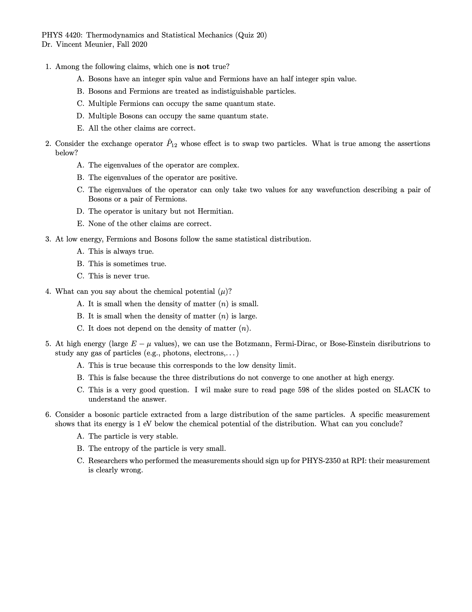
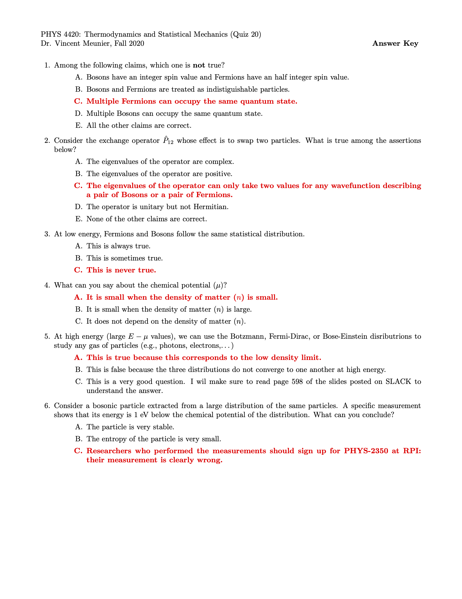

.. _example:

Example of multiple questions
+++++++++++++++++++++++++++++

Yaml input
----------

.. code-block:: yaml

   - Type: MC
     Text: 'Among the following claims, which one is \textbf{not} true?'
     Size: Auto
     Points: 2
     Answers:
     - Choice: Bosons have an integer spin value and Fermions have an half integer spin value.
     - Choice: Bosons and Fermions are treated as indistiguishable particles.
     - Choice: Multiple Fermions can occupy the same quantum state.
       Validity: correct
     - Choice: Multiple Bosons can occupy the same quantum state.
     - Choice: 'All the other claims are correct.  '
     Note: lecture 29
   - Type: MC
     Text: >-
        Consider the exchange operator $\hat{P}_{12}$ whose effect is to swap two
        particles. What is true among the assertions below? 
     Size: Auto
     Points: 2
     Answers:
     - Choice: The eigenvalues of the operator are complex.
     - Choice: The eigenvalues of the operator are positive.
     - Choice: >-
         The eigenvalues of the operator can only take two values for any 
         wavefunction describing a pair of Bosons or a pair of Fermions.
       Validity: correct
     - Choice: 'The operator is unitary but not Hermitian.'
     - Choice: 'None of the other claims are correct.  '
     Note: lecture 29
   - Type: MC
     Text: 'At low energy, Fermions and Bosons follow the same statistical distribution.'
     Size: Auto
     Points: 2
     Answers:
     - Choice: This is always true.
     - Choice: This is sometimes true.
     - Choice: This is never true.
       Validity: correct
     Note: lecture 29
   - Type: MC
     Text: What can you say about the chemical potential ($\mu$)?
     Size: Auto
     Points: 2
     Answers:
     - Choice: It is small when the density of matter ($n$) is small.
       Validity: correct
     - Choice: It is small when the density of matter ($n$) is large.
     - Choice: 'It does not depend on the density of matter ($n$).  '
     Note: lecture 29
   - Type: MC
     Text: >-
      At high energy (large $E-\mu$ values), we can use the Botzmann, 
      Fermi-Dirac, or Bose-Einstein disributrions to study any gas of 
      particles (e.g., photons, electrons,\ldots) 
     Size: Auto
     Points: 2
     Answers:
     - Choice: 'This is true because this corresponds to the low density limit. '
       Validity: correct
     - Choice: >-
         This is false because the three distributions do not converge to  one
         another at high energy.
     - Choice: >-
         This is a very good question. I wil make sure to read page 598 of  the
         slides posted on SLACK to understand the answer.   
     Note: lecture 29
   - Type: MC
     Text: >-
      Consider a bosonic particle extracted from a large distribution of the  same
      particles. A specific measurement shows that its energy is 1~eV  below the
      chemical potential of the distribution.  What can you conclude?
     Size: Auto
     Points: 2
     Answers:
     - Choice: 'The particle is very stable. '
       Validity: incorrect
     - Choice: 'The entropy of the particle is very small. '
       Validity: incorrect
     - Choice: >-
        Researchers who performed the measurements should sign up for  PHYS-2350
        at RPI: their measurement is clearly wrong. 
       Validity: correct
     Note: lecture 29

Latex Output
------------
The latex output for this entry is thus:

Latex Output with keys
----------------------
If you used the :code:`SolutionKey: yes` option, you would get:

