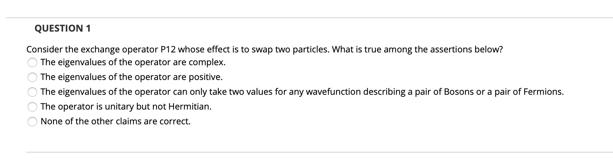
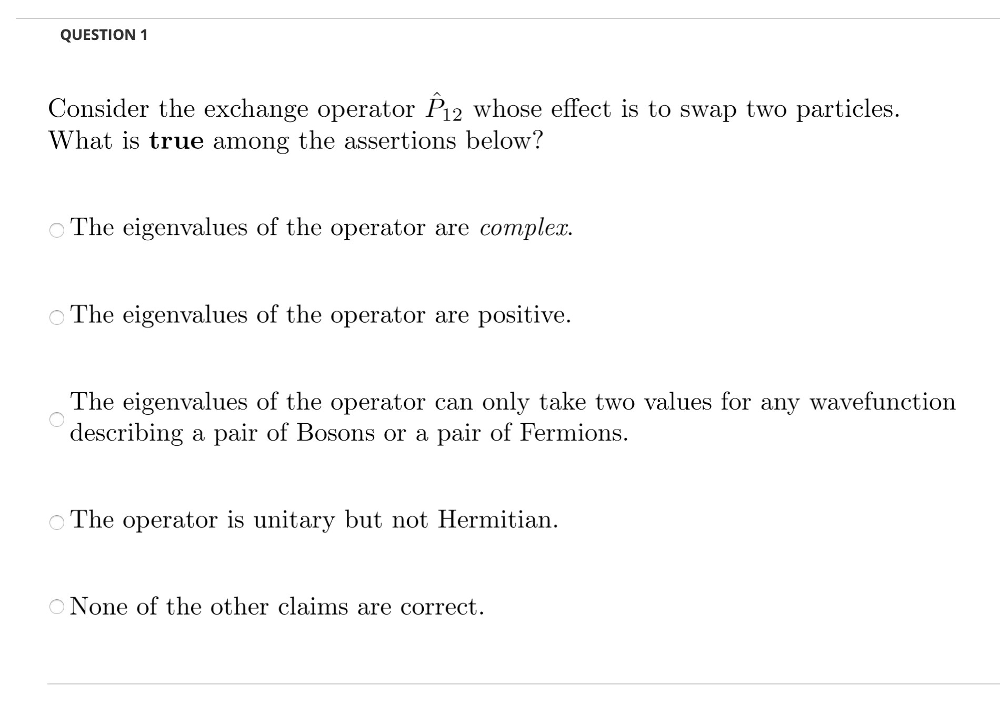

.. _lms-label:

LMS Output
++++++++++
One of the goals of *yaml2lms* is to create an interface between a list of questions you create locally to a format that can be directly imported into an online teaching platform such as *blackboard*. It is called Learning Management System (LMS) at Rensselaer Polytechnic Institute. However, the same format is used widely in systems such as *canvas*.

It is possible to import questions on LMS but the format is somewhat
difficult to handle. The format can be found at various places online,
such as as on the Blackboard_ website.

The primary goal of this script is to translate the *yaml*-formatted questions into a file readable by Blackboard. 

.. _Blackboard: https://help.blackboard.com/Learn/Instructor/Tests_Pools_Surveys/Reuse_Questions/Upload_Questions/

Text only
---------
If you only have unformatted text in your questions, this is the option you need to use in the *config.yaml* file (:code:`createLMS_text: yes`), as described in :ref:`config-label`. In this case, all the information is stored in a file that can be directly uploaded onto lms.

.. note:: the name of the output file is built from the <prefix> of the input file name provided in *config.yaml* under :code:`yamlfile: <prefix>.yaml` to which "_LMS_text.txt" is appended.

Example:

If the input is:

.. code-block:: yaml
		
   - Type: MC
     Text: >-
       Consider the exchange operator P12 whose effect is to swap two
       particles. What is true among the assertions below? 
     Answers:
     - Choice: The eigenvalues of the operator are complex.
     - Choice: The eigenvalues of the operator are positive.
     - Choice: >-
         The eigenvalues of the operator can only take two values for any 
         wavefunction describing a pair of Bosons or a pair of Fermions.
       Validity: correct
     - Choice: 'The operator is unitary but not Hermitian.'
     - Choice: 'None of the other claims are correct.  '
     Note: lecture 29

The output becomes:

 .. code-block::

    MC Consider the exchange operator P12 whose effect is
     to swap two particles. What is true among the assertions below?
     The eigenvalues of the operator are complex.  incorrect The
     eigenvalues of the operator are positive.  incorrect The
     eigenvalues of the operator can only take two values for any
     wavefunction describing a pair of Bosons or a pair of Fermions.
     correct The operator is unitary but not Hermitian.  incorrect
     None of the other claims are correct.  incorrect

You can upload the file :code:`<prefix>_lms_text.txt` on LMS when creating a new test (or adding a question to an existing test) and you obtain a result like this:

.. Note:: In this example, we only used one question but if the *yaml* file contains multiple questions, they will be included into the test on LMS. 
	
 
LMS using images
----------------
The method described above works very well and is very fast in terms of processing time.
However, it does not allow for fancy formatting and, while possible, the inclusion of math symbols is neither straitghforward nor totally satisfactory.
Here, I describe the second method to create an LMS test using more advanced formatting. In this case you need to use this option: :code:`createLMS: yes`.

It is **important to note** that this mode uses a collection of small images to assemble the questions (each image is created by LaTeX). So, one caveat with this method is that you need a place where you will copy the images and that place has to be accessible on the web.

.. Important:: The *LMS using images* mode is only possible if you have a place where you can copy the images to be accessible on a browser.

The place where the images will be copied is provided in the keyword :code:`base: <httpsite>` provided in file *config.yaml*, as described in :ref:`config-label`.

.. note:: The name of the output file is built from the <prefix> of the input file name provided in *config.yaml* under :code:`yamlfile: <prefix>.yaml` to which "_LMS_png.txt" is appended.

Let's describe the process using an example. The example is similar to the one we used for the text-only option but in this case, we added some LaTeX and some formatting code. 
	  
If the input is:

.. code-block:: yaml
		
   - Type: MC
     Text: >-
       Consider the exchange operator $\hat{P}_{12}$  whose effect is to swap two
       particles. What is \textbf{true} among the assertions below? 
     Answers:
     - Choice: The eigenvalues of the operator are \textit{complex}.
     - Choice: The eigenvalues of the operator are positive.
     - Choice: >-
         The eigenvalues of the operator can only take two values for any 
         wavefunction describing a pair of Bosons or a pair of Fermions.
       Validity: correct
     - Choice: 'The operator is unitary but not Hermitian.'
     - Choice: 'None of the other claims are correct.  '
     Note: lecture 29

When using the option :code:`createLMS: yes`, *yaml2lms* creates a file :code:`<prefix>_lms_png.txt` along with a directory with a collection of images. 
The output stored in  :code:`<prefix>_lms_png.tx` looks something like this (though you will probably never have to look at it, as the idea of the script is to avoid it!)

.. code-block::

    MC 

 

 incorrect 

 incorrect 

 correct 

 incorrect 

 incorrect

You can see from the example that the script tells LMS that the various image files are stored, in this example, at "http://homepages.rpi.edu/~meuniv/Images/TSM_F20/Questions_THERMO_test3".This address was created using the :code:`base: "http://homepages.rpi.edu/~meuniv/Images/TSM_F20/"` provided in *config.yaml* and the directory is built from :code:`dir: "THERMO"`.

Now that you have completed this, you only need two more steps.

1. Copy the image directory to the place where you want to move the file. This can be done easily with a method such as :code:`scp -r Questions_THERMO_test3  meuniv@rcs.rpi.edu:~/public_html/Images/TSM_F20/.` This line is provided for your convenience at the end of the script. Of course you need to change the username and the address of the server where you place the file. Here I use the space provided by my university but using a different repository may not be a bad idea (github or even dropbox).

2. Go to LMS and upload the questions, using the file :code:`<prefix>_lms_png.txt` as described above.

After uploading the question, the exam looks like this:

The content is the same as in the example using text only. I personally prefer this approach as it makes for much nicer looking exam, even when no math is required. However, note that the other method is somewhat more straighforward.

.. Important:: Do not turn on the creation of LMS files (using either method) until you have carefully checked the PDF created with the default options. It is also important to check that the asnwers you selected as correct are indeed correct (check the PDF with the answer keys). It is always possible to change that on LMS itself but it is not as easy. 
