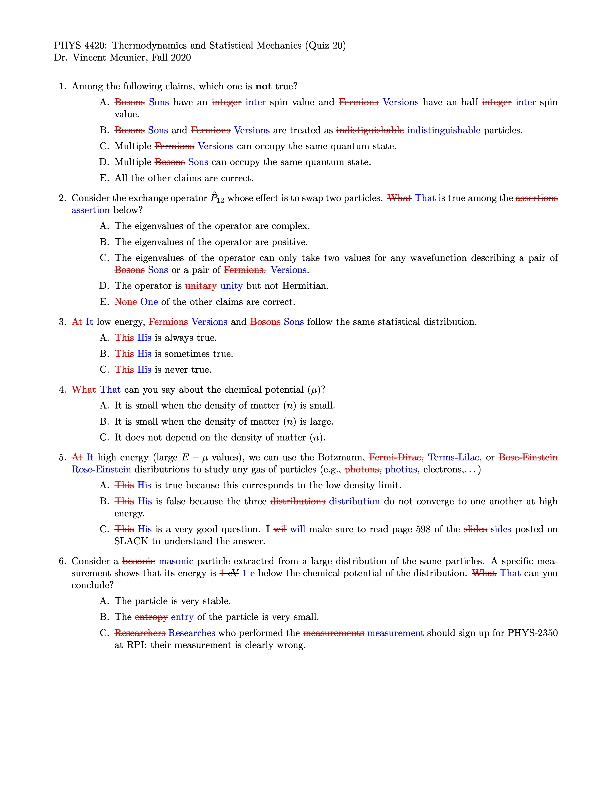

.. _spellcheck-label:

Spellchecking
+++++++++++++

.. Note:: This features remains in development but can be useful to identify basic typos.

Usage
-----
When you use the :code:`spellcheck: yes` in the :code:`config.yaml` file, *yam2lms* will perform a spellcheck of the questions. Currently, the script uses the python library provided in the :code:`spellchecker` module.

The script will check all words in the document and provide a corrected version called :code:`XXX_SPELLCHECKED.pdf` file. Using the example provided in :ref:`my-reference-label`, we get the result shown below.

Notes
-----
1. The process is slow. Once you have run this and corrected your mistake(s), turn this option off to avoid lenghty processing.
2. *yaml2lms* does not make any correction; instead it makes suggestions as shown in the exmaple below. In this example, most of the mistakes found are actually **not** mistakes and it is expected each user will look into this separately. Only one word was correctly flagged as incorrect.
3. Clearly this utility needs work but it at least avoid making too many obvious **mistkaes**. 

Example
-------

